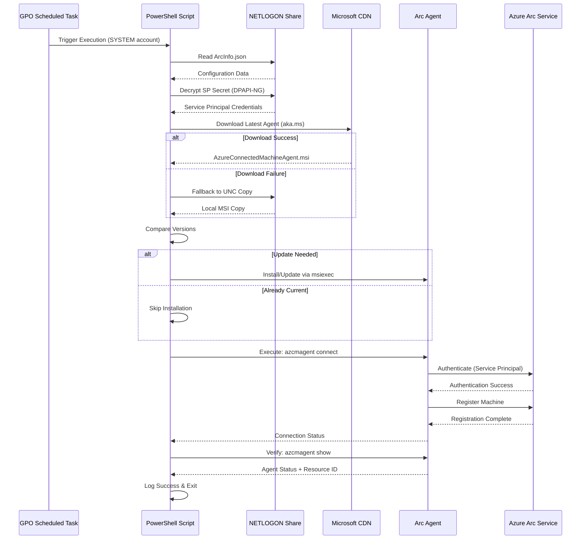

# Azure Arc Agent GPO Deployment# Azure Arc GPO Onboarding


> **Automate Windows Server onboarding to Azure Arc using Group Policy**This repository contains a PowerShell script and instructions for onboarding Windows Servers to Azure Arc using Group Policy (GPO).


This repository provides a **production-ready PowerShell solution** for deploying and managing Azure Arc Connected Machine Agent across Windows Server environments using Group Policy Objects (GPO).## Overview


## 🚀 Key FeaturesThe script is designed to be deployed via a GPO Scheduled Task and supports:


| Feature | Description |- **Automatic installation or upgrade** of the Azure Connected Machine Agent (CMA)  

|---------|-------------|  - Attempts to download the latest CMA from Microsoft  

| **Automatic Agent Management** | Downloads, installs, and updates Azure Connected Machine Agent |  - Falls back to a UNC share if direct download fails  

| **GPO-Based Deployment** | Centralized deployment via Active Directory Group Policy |- **Service Principal authentication** for non-interactive onboarding  

| **Service Principal Authentication** | Secure, non-interactive onboarding |  - Securely decrypts the service principal secret from `encryptedServicePrincipalSecret`  

| **Encrypted Secrets** | DPAPI-NG encryption for Service Principal credentials |  - Falls back to a plain-text value in `ArcInfo.json` (for testing only)  

| **Version Management** | Automatic upgrade detection and installation |- **Custom tagging** of onboarded servers from values in `ArcInfo.json`  

| **Flexible Configuration** | JSON-based configuration with tags and custom settings |- **Proxy configuration** (optional)

| **Proxy Support** | Built-in support for corporate proxy environments |

| **Private Link Ready** | Support for Azure Arc Private Link Scope |## File Structure

| **Comprehensive Logging** | Detailed execution logs for troubleshooting |

- `Onboard-AzureArc.ps1` – Main onboarding script  

## 📐 Architecture- `ArcInfo.json` – Configuration file containing:

  - Tenant ID

```mermaid  - Subscription ID

graph TB  - Resource Group

    subgraph "Active Directory Environment"  - Location

        DC[Domain Controller<br/>NETLOGON Share]  - Service Principal Client ID

        GPO[Group Policy Object]  - Tags (optional)

        - `encryptedServicePrincipalSecret` – Encrypted service principal secret  

        subgraph "Deployment Files"- `AzureConnectedMachineAgent.msi` – (Optional) Offline CMA installer

            SCRIPT[azure-arc-onboarding.ps1]

            CONFIG[ArcInfo.json]## How It Works

            SECRET[encryptedServicePrincipalSecret]

            MODULE[AzureArcDeployment.psm1]1. **Reads `ArcInfo.json`** from a UNC path (e.g., `\\<domain>\NETLOGON\ArcDeploy`).

            MSI[AzureConnectedMachineAgent.msi]2. **Decrypts the SP secret** from `encryptedServicePrincipalSecret` if present.

        end3. **Downloads the latest CMA** from Microsoft’s official endpoint.

        4. **Installs or updates the agent** if a newer version is found.

        DC --> SCRIPT5. **Connects the machine to Azure Arc** using:

        DC --> CONFIG   - Resource name (local hostname)

        DC --> SECRET   - Service Principal credentials

        DC --> MODULE   - Configured subscription, resource group, location

        DC --> MSI6. **Applies tags** from `ArcInfo.json`.

    end

    ## GPO Deployment

    subgraph "Target Servers"

        SVR1[Windows Server 1]1. Copy the following to a domain-accessible share (e.g., `\\<domain>\NETLOGON\ArcDeploy`):

        SVR2[Windows Server 2]   - Script (`Onboard-AzureArc.ps1`)

        SVR3[Windows Server N...]   - `ArcInfo.json`

           - `AzureArcDeployment.psm1`

        SVR1 -.->|Scheduled Task| EXEC1[Execute Script]   - `encryptedServicePrincipalSecret`

        SVR2 -.->|Scheduled Task| EXEC2[Execute Script]   - `AzureConnectedMachineAgent.msi` (optional)

        SVR3 -.->|Scheduled Task| EXEC3[Execute Script]2. Create a Scheduled Task in GPO to run the script:

    end   - Action: **Start a Program**

       - Program: `powershell.exe`

    subgraph "Azure"   - Arguments: `-ExecutionPolicy Bypass -File "\\<domain>\NETLOGON\ArcDeploy\Onboard-AzureArc.ps1"`

        AAD[Azure AD<br/>Service Principal]   - Run as **SYSTEM**

        ARC[Azure Arc]3. Link the GPO to the target OU.

        RG[Resource Group]

        ## Example `ArcInfo.json`

        EXEC1 -->|Authenticate| AAD

        EXEC2 -->|Authenticate| AAD```json

        EXEC3 -->|Authenticate| AAD{

          "TenantId": "00000000-0000-0000-0000-000000000000",

        AAD -->|Connect| ARC  "SubscriptionId": "00000000-0000-0000-0000-000000000000",

        ARC --> RG  "ResourceGroup": "Arc-Servers",

    end  "Location": "eastus",

      "ServicePrincipalClientId": "00000000-0000-0000-0000-000000000000",

    GPO -.->|Apply Policy| SVR1  "Tags": {

    GPO -.->|Apply Policy| SVR2    "Environment": "Prod",

    GPO -.->|Apply Policy| SVR3    "Owner": "IT"

      }

    EXEC1 -.->|Read Config| DC}

    EXEC2 -.->|Read Config| DC
    EXEC3 -.->|Read Config| DC

    style GPO fill:#e1f5fe
    style ARC fill:#fff3e0
    style AAD fill:#e8f5e8
    style DC fill:#f3e5f5
```

### 🔄 Onboarding Flow



## 📁 Project Structure

```
arc-agent-deploy/
├── azure-arc-onboarding.ps1      # Main onboarding script
├── ArcInfo.json.example          # Configuration template
├── README.md                     # This documentation
└── deployment-files/             # Files to deploy to NETLOGON
    ├── ArcInfo.json                 # Actual configuration (create from example)
    ├── encryptedServicePrincipalSecret  # Encrypted SP secret
    ├── AzureArcDeployment.psm1      # DPAPI-NG decryption module
    └── AzureConnectedMachineAgent.msi   # (Optional) Offline installer
```

## ⚡ Quick Start

### Prerequisites

- ✅ Active Directory domain environment
- ✅ Azure subscription with appropriate permissions
- ✅ Azure AD Service Principal with Arc onboarding rights
- ✅ Domain-accessible file share (e.g., NETLOGON)
- ✅ Windows Server 2012 R2 or later target machines

### Step 1: Create Azure Resources

Create a Service Principal for Arc onboarding:

```powershell
# Connect to Azure
Connect-AzAccount

# Create Service Principal
$sp = New-AzADServicePrincipal -DisplayName "AzureArc-GPO-Onboarding" -Role "Azure Connected Machine Onboarding"

# Save these values for ArcInfo.json
$sp.AppId          # ServicePrincipalClientId
$sp.PasswordCredentials.SecretText  # Service Principal Secret
(Get-AzContext).Tenant.Id  # TenantId
(Get-AzContext).Subscription.Id  # SubscriptionId
```

### Step 2: Prepare Configuration

1. **Copy and customize ArcInfo.json:**
   ```powershell
   Copy-Item ArcInfo.json.example \\<domain>\NETLOGON\ArcDeploy\ArcInfo.json
   ```

2. **Edit with your values:**
   ```json
   {
     "ServicePrincipalClientId": "<your-sp-app-id>",
     "TenantId": "<your-tenant-id>",
     "SubscriptionId": "<your-subscription-id>",
     "ResourceGroup": "Arc-Servers",
     "Location": "eastus",
     "Tags": {
       "Environment": "Production",
       "ManagedBy": "GPO",
       "Department": "IT"
     }
   }
   ```

### Step 3: Encrypt Service Principal Secret (Recommended)

For production environments, use encrypted secrets:

```powershell
# Create encryption module and encrypt secret
# (Details in SECURITY.md - requires DPAPI-NG setup)
$secret = "<your-sp-secret>"
# Use DPAPI-NG to encrypt and save to encryptedServicePrincipalSecret
```

**For testing only**, you can use plain-text in ArcInfo.json:
```json
{
  "ServicePrincipalSecretPlain": "<your-sp-secret>"
}
```

### Step 4: Deploy Files to NETLOGON

Copy all required files to your domain share:

```powershell
$deployPath = "\\<domain>\NETLOGON\Global\Arc\AzureArcDeploy"
New-Item -Path $deployPath -ItemType Directory -Force

Copy-Item azure-arc-onboarding.ps1 $deployPath\
Copy-Item ArcInfo.json $deployPath\
Copy-Item encryptedServicePrincipalSecret $deployPath\  # If using encryption
Copy-Item AzureArcDeployment.psm1 $deployPath\          # If using encryption
```

### Step 5: Create GPO Scheduled Task

1. **Open Group Policy Management Console**
2. **Create or edit a GPO** linked to your target servers OU
3. **Navigate to:**
   ```
   Computer Configuration → Preferences → Control Panel Settings → Scheduled Tasks
   ```

4. **Create new Scheduled Task:**
   - **Name:** Azure Arc Onboarding
   - **User:** `NT AUTHORITY\SYSTEM`
   - **Run whether user is logged on or not:** ✓
   - **Run with highest privileges:** ✓
   - **Trigger:** Daily (or at startup + daily for retry logic)
   - **Action:** Start a program
     - **Program:** `powershell.exe`
     - **Arguments:** `-ExecutionPolicy Bypass -WindowStyle Hidden -File "\\<domain>\NETLOGON\Global\Arc\AzureArcDeploy\azure-arc-onboarding.ps1"`

5. **Link GPO to target OU**

### Step 6: Verify Deployment

Wait for GPO to apply (or force with `gpupdate /force`), then check:

```powershell
# On target server - check if agent is installed
Test-Path "C:\Program Files\AzureConnectedMachineAgent\azcmagent.exe"

# Check agent status
& "C:\Program Files\AzureConnectedMachineAgent\azcmagent.exe" show

# Review logs
Get-Content "$env:TEMP\ArcAgent\arc-onboarding-*.log" | Select-Object -Last 50
```

In Azure Portal:
- Navigate to **Azure Arc → Servers**
- Verify your servers appear with correct tags

## 🔧 Configuration Options

### ArcInfo.json Schema

| Field | Required | Description | Example |
|-------|----------|-------------|---------|
| `ServicePrincipalClientId` | ✅ | Azure AD Application (client) ID | `"00000000-0000-0000-0000-000000000000"` |
| `TenantId` | ✅ | Azure AD Tenant ID | `"00000000-0000-0000-0000-000000000000"` |
| `SubscriptionId` | ✅ | Azure Subscription ID | `"00000000-0000-0000-0000-000000000000"` |
| `ResourceGroup` | ✅ | Target Resource Group name | `"Arc-Servers"` |
| `Location` | ✅ | Azure region | `"eastus"` |
| `Tags` | ❌ | Custom tags object | `{"Environment": "Prod"}` |
| `PrivateLinkScopeId` | ❌ | Azure Arc Private Link Scope resource ID | `"/subscriptions/.../privateLinkScopes/..."` |
| `ProxyUrl` | ❌ | HTTP(S) proxy URL | `"http://proxy.contoso.com:8080"` |
| `ServicePrincipalSecretPlain` | ❌ | **Testing only** - Plain-text SP secret | `"your-secret"` |

### Script Configuration

Edit these variables in `azure-arc-onboarding.ps1` if needed:

```powershell
$SourceFilesFullPath = '\\lvdc-dc02\netlogon\Global\Arc\AzureArcDeploy'  # UNC path to files
$WorkFolder          = "$env:TEMP\ArcAgent"                               # Local temp folder
```

## 🔒 Security Best Practices

| Practice | Implementation |
|----------|----------------|
| **Encrypted Secrets** | Use DPAPI-NG encrypted `encryptedServicePrincipalSecret` file |
| **Least Privilege** | Service Principal should only have "Azure Connected Machine Onboarding" role |
| **Secure File Share** | Restrict NETLOGON folder access to authorized systems only |
| **Audit Logging** | Review execution logs regularly in `$env:TEMP\ArcAgent\` |
| **Rotate Credentials** | Periodically rotate Service Principal secret |
| **Private Link** | Use Azure Arc Private Link Scope for enhanced network security |
| **Avoid Plain-Text** | Never use `ServicePrincipalSecretPlain` in production |

## 📊 Monitoring & Troubleshooting

### Checking Deployment Status

**On target server:**
```powershell
# View latest log file
$latestLog = Get-ChildItem "$env:TEMP\ArcAgent\arc-onboarding-*.log" | Sort-Object LastWriteTime -Descending | Select-Object -First 1
Get-Content $latestLog.FullName

# Check agent status
& "C:\Program Files\AzureConnectedMachineAgent\azcmagent.exe" show -j | ConvertFrom-Json

# Check scheduled task history
Get-ScheduledTask "Azure Arc Onboarding" | Get-ScheduledTaskInfo
```

**In Azure Portal:**
```
Azure Arc → Servers → [Check for registered machines]
Azure Arc → Servers → [Machine] → Activity Log
```

### Common Issues

| Issue | Cause | Solution |
|-------|-------|----------|
| Agent not installing | Download failure, no internet access | Ensure MSI is in NETLOGON share, check proxy settings |
| Authentication failure | Wrong SP credentials, expired secret | Verify SP credentials in ArcInfo.json, check secret expiration |
| Connection timeout | Firewall blocking Arc endpoints | Whitelist required URLs (see below) |
| DPAPI decrypt fails | Wrong encryption context | Re-encrypt secret, ensure machine/domain context matches |
| "Resource already exists" | Server previously registered | Disconnect old registration or use existing resource |

### Required Network Endpoints

Allow outbound HTTPS (443) to:
- `aka.ms` - Agent download
- `*.guestconfiguration.azure.com` - Guest configuration
- `*.his.arc.azure.com` - Hybrid identity service  
- `*.guestnotificationservice.azure.com` - Notification service
- `management.azure.com` - Azure Resource Manager
- `login.microsoftonline.com` - Azure AD authentication

Full list: [Azure Arc network requirements](https://learn.microsoft.com/azure/azure-arc/servers/network-requirements)

## 🧪 Testing

### Manual Test Execution

Run script directly on a test server:

```powershell
# As Administrator
Set-ExecutionPolicy Bypass -Scope Process
\\<domain>\NETLOGON\Global\Arc\AzureArcDeploy\azure-arc-onboarding.ps1
```

### Verify GPO Application

```powershell
# Force GPO update
gpupdate /force

# Check if scheduled task was created
Get-ScheduledTask "Azure Arc Onboarding"

# Run task immediately
Start-ScheduledTask "Azure Arc Onboarding"
```

### Validate Azure Registration

```powershell
# Azure PowerShell
Connect-AzAccount
Get-AzConnectedMachine -ResourceGroupName "Arc-Servers"

# Azure CLI
az connectedmachine list --resource-group Arc-Servers --output table
```

## 📚 Additional Resources

- **[Azure Arc Documentation](https://learn.microsoft.com/azure/azure-arc/servers/)** - Official Microsoft docs
- **[azcmagent CLI Reference](https://learn.microsoft.com/azure/azure-arc/servers/azcmagent-reference)** - Agent command reference
- **[Azure Arc Jumpstart](https://azurearcjumpstart.io/)** - Community-driven scenarios
- **[Network Requirements](https://learn.microsoft.com/azure/azure-arc/servers/network-requirements)** - Firewall and proxy configuration

## 🤝 Contributing

Contributions are welcome! Please:
1. Fork this repository
2. Create a feature branch
3. Test your changes thoroughly
4. Submit a pull request with clear description

## 📝 Version History

| Version | Date | Changes |
|---------|------|---------|
| 2.0 | 2025-10-28 | Enhanced logging, proxy support, private link, improved error handling |
| 1.0 | Initial | Basic GPO deployment script |

## 📄 License

This project is provided as-is for educational and reference purposes.

---

<div align="center">

**Built with ❤️ for Azure Arc adoption at scale**

</div>
